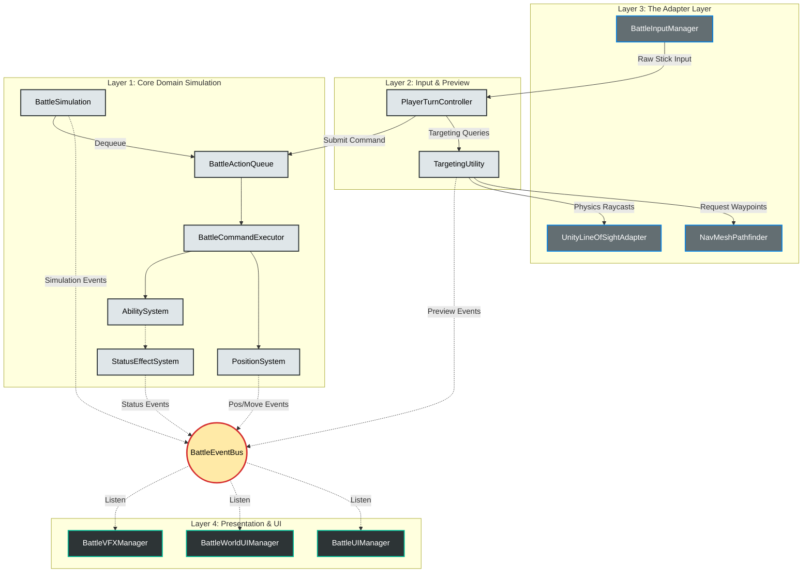
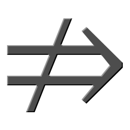

# Ashes (v0.0.1 — Playable Prototype)

This repository contains a prototype battle system for a turn-based RPG that combines an ATB system with gridless, spatial positioning.

The primary goal of this project is to build a robust, scalable RPG combat architecture that separates pure gameplay logic from the Unity presentation layer. Version 0.0.1 delivers a fully playable, headless-capable combat loop utilizing simple graphics to prove out the core mathematical simulation.

## Core Engineering Philosophy

The architecture relies on Domain-Driven Design (DDD). We isolate the combat simulation from the Unity engine using a decoupled pipeline that utilizes interface injection and engine adapters.

**Initialization: The Bootstrapper**
The battle system is entirely self-contained and must be instantiated by a bootstrapper. Currently handled by `BattleTestBootstrapper` for faster, isolated testing, this layer will eventually seamlessly transition the game from exploration/cutscenes into combat.

* **Dependency Injection:** The bootstrapper acts as the composition root. It constructs the `BattleSimulation` by injecting it with the necessary Unity-backed adapters (e.g., `IPathfinder`, `ILineOfSightChecker`, and various databases).
* **Zero MonoBehaviour Coupling:** The `BattleSimulation` constructor specifically requests interfaces, ensuring the core engine remains unaware of Unity's component architecture.

### 1. Simulation Layer (The Core Domain)

The core of the gameplay logic. It contains the deterministic systems that control battle mechanics, ATB time flow, pathfinding, ability resolution, the modular effect pipeline, and status effect management.

* **Engine-Agnostic:** This layer is written in pure C# and contains no `UnityEngine` dependencies.
* **Headless Capable:** The simulation can run entirely in the background, allowing for automated testing without rendering a single frame.

### 2. Preview Layer (The Input State Machine)

Preview systems calculate predicted outcomes before a command executes. They mirror the simulation logic to provide targeting feedback, damage previews, and movement paths without mutating the actual game state. Before modifying the actual simulation state, player intent is processed through a non-mutating C# state machine (`PlayerTurnController`).

* **Interface Relay:** Each state implements specific interfaces to relay menu selections or targeting data down to the simulation.
* **Data Routing and Translation:** When in a targeting state, the engine gathers raw data from Unity (e.g. projected mouse positions, pathfinding, etc.) and passes it through the adapter layer to the simulation.
* **Dynamic Visual Pipeline:** `TargetingUtility` provides a centralized pipeline for targeting preview and validation in the Simulation Layer. After processing the targeting data, updates are published through the `BattleEventBus`.

### 3. The Adapter Layer (Event Bus)

This layer translates data between Unity and the C# backend, ensuring the simulation never directly touches Unity classes.

* **Event & Input Hubs:** The `BattleEventBus` and `BattleInputManager` act as the primary communication bridges.
* **Data Conversion:** Structural adapters like `VectorAdapter` convert Unity's `Vector3` into the simulation's raw `SimVector3` math class.
* **Input Translation:** The `BattleInputManager` translates analog hardware input into camera-relative, world-space vectors.
* **Interface Implementations:** Unity-specific logic is wrapped in concrete classes that fulfill Domain contracts. Examples include:
    * `UnityNavMeshValidator` implements `IMapValidator`.
    * `UnityLineOfSightAdapter` implements `ILineOfSightChecker` via Physics Raycasts.
    * `NavMeshPathfinder` implements `IPathfinder` to translate simulated coordinates into NavMesh queries and return pure waypoints.


### 4. Presentation Layer

The presentation layer contains all Unity-specific components, including 3D rendering, URP decals, UI, and VFX. The Presentation layer blindly obeys the Domain and never dictates game state; it strictly reacts to events emitted by the simulation.

* **The MVP Pattern:** UI Controllers act as Presenters. They listen to C# events, query the simulation for data, and push updates to the visual Canvas without coupling.
* **World-Space Visuals:** Manages billboarded hover panels, cloned ghost previews, and dynamic UI pop-outs using pure coordinates.
* **URP Decal Rendering:** Translates targeting data into highlighted blast zones drawn directly onto the arena geometry.
* **VFX Auto-Discovery:** Visual managers utilize lazy-loading pipelines to dynamically find and highlight 3D actor meshes without hardcoded scene references.

### Architecture Overview
---


---

## Battle System Overview

The combat system uses an **Active Time Battle (ATB)** model. An internal clock drives the simulation, dynamically pausing and resuming to accommodate animations and command execution.

When an ATB meter fills, the actor becomes ready and may construct a Command. Commands are multi-step and consist of:

```text
Move + Action (or)
Action + Move (or)
Move/Action + Wait
```

*(Where Move = repositioning via NavMesh, and Action = attack, ability, or item).*

Commands (at this time) are always 2 steps, and composed of some combination of `MoveStep`, `AbilityStep`, and/or `WaitStep`.

The player constructs the full command, previews its outcome, and then submits it to be packaged by the `BattleCommandBuilder` and added to the `BattleActionQueue` for execution.


---

## Implemented Systems (v0.0.1)

### Ability Resolution & Status Effects

* **Modular Effect Pipeline:** Abilities are not hardcoded scripts; they execute through a sequential, decoupled pipeline (Target Validation ➔ Damage/Heal Resolution ➔ Status Application). This architecture makes skills highly reusable and composable.
* **Dynamic Data Models:** Actions are serialized with rich semantic data (`ImpactType`, `ElementType`, `CanTargetDead`). This allows the C# simulation to evaluate the intent of an action (Help vs. Harm) without relying on hardcoded faction-alignment.
* **Status Effect System:** A robust manager that handles the lifecycle of buffs and debuffs. It ticks durations in sync with the ATB clock and dynamically modifies underlying actor stats.

### Tactical Targeting & Previews

* **Dynamic "Ghost" Previews:** When a player selects a position to move to, the Presentation layer dynamically clones the actor's mesh, projecting a translucent hologram to the future destination. This preview is shown during Pursuit-enabled commands where movement is implicit and during any targeting actions that follow the `MoveStep`. All subsequent targeting line-of-sight and AoE math originates from this future position.

| Preview Future Position |
| :---: |
|  |


* **Pursuit Mode:** A dynamic routing system that allows characters to intelligently calculate the path required to walk into range and strike a moving target, reserving the space and executing the approach automatically.

| Attack w/ Implicit Movement|
| :---: |
| <br><br>Pursuit Off: &nbsp;     &nbsp;&nbsp;&nbsp;&nbsp;&nbsp;&nbsp; Pursuit On: &nbsp;  |


* **Movement Path Previews:** Real-time path generation that validates NavMesh coordinates, rendering the exact movement spline and visually indicating the maximum valid movement distance.

| Real-time Pathfinding |
| :---: |
|  |


* **URP Decal Projectors:** Damage zones and range indicators are projected onto arena geometry using the Unity Decal Renderer Feature and a Shader Graph that dynamically highlights based on targeting alignments and outcome (Help vs. Harm).

| AoE Targeting | Directional Targeting |
| :---: | :---: |
|  |  |

* **Advanced Targeting & Magnetism:** Support for Single Target, Actor AoE, Point AoE (Free Aim), Directional Cones, and Self-targeting. Includes dual analog stick controls, target snapping, and Free Aim toggling.


### Grid Integrity & Position Lifecycle

* **Autonomous Garbage Collection:** To support gridless movement without overlapping actors, the `PositionSystem` implements a NavMesh space reservation. Spaces are reserved as commands are placed into the queue and the `PositionSystem` listens to `MoveCompletedEvent` to clear a reservation exactly as the actor arrives to occupy it.

### UI & Presentation Architecture

* **World-Space Unit Panels:** Billboarded hover UI featuring radial ATB rings. Visibility is integrated with the simulation, remaining hidden to reduce screen clutter and dynamically appearing based on threat thresholds (e.g. an enemy ATB crosses 50%) or active targeting.

| Hovering Status Panels|
| :---: |
|  |


* **Target Info & Status Panels:** Event-synced UI panels that display real-time interpolated HP/ATB data and utilize object pooling to dynamically layout active buff/debuff status icons for the currently focused actor.

| Focused Target Panel |
| :---: |
|  |


* **Event-Driven Tooltips:** Command menus decouple visual rendering from database polling. Pure C# hover events broadcast ability IDs, allowing the UI to dynamically fetch and display MP costs, elemental data, descriptions, and targeting rules.

| Command Menu Tooltips |
| :---: |
|  |


* **Floating Combat Text (FCT):** Responds to combat events to spawn and destroy a floating text prefab in world space to display damage, healing, and effects.

| Floating Combat Text |
| :---: |
|  |

---

## Development Roadmap

The battle system is being built in incremental phases to ensure the underlying architecture remains stable as complexity increases. With the foundational simulation and tactical UI complete, development is currently shifting toward 3D presentation, followed by an expansion of the ruleset and AI logic.

### Phase 11: 3D Assets, Animation & Execution

**Objective:** Replace primitive shapes with actual art assets and synchronize the underlying mechanical simulation with visual animations.

* **3D Models & Animations:** Import rigged models and hook up Animator controllers (Idle, Walk, Attack, Cast, Hit, Die). Ensure their center points and NavMesh Agent radii perfectly match the underlying `BattleActor` math.
* **Two-Way Event Synchronization:** Refactor the `BattleCommandExecutor`. The C# Domain will broadcast a `PlayAnimationEvent`, while Unity timeline markers will fire `AnimationImpactEvent` and `AnimationFinishedEvent` back to the Domain. This allows the simulation to pause the `BattleClock` while animations/particles play out, preventing desyncs.
* **VFX Implementation:** Expand the `BattleVFXManager` to handle particle instantiators, camera shakes, and audio hooks.
* **Targeting Aesthetics:** Upgrade the Path Preview from a basic `LineRenderer` to a stylized dotted line/spline. Edit the Custom Shader Graph to use a dot-product mask for dynamic cone angle trimming during `TargetingMode.Directional` previews.
* **ATB Refunds Audit:** Rigorously test interrupted commands. If a target dies while an actor is running toward them, the engine must correctly abort the `MoveStep` and issue an `ATBChangeRequestEvent` based on the ability's refund percentage.

### Phase 12: Advanced Mechanics & Utility AI

**Objective:** Expand the effect pipeline for complex elemental interactions and replace the basic AI with a robust, scoring-based Utility AI.

* **The Multi-Pass Effect Pipeline:** Refactor effect processing to calculate armor mitigation before triggering Combo Interactions (ensuring 0-damage hits do not trigger on-damage statuses).
* **Elemental Reaction Engine:** Add `ElementType` to attacks and `TriggerElement` to statuses, allowing spells to natively detonate environmental states (e.g., Fire igniting "Oil" or melting "Frozen").
* **Advanced Casting & Cooldowns:** Introduce ATB charge timers for massive spells (suspending execution until the cast finishes) and implement turn/time-based cooldowns.
* **Reaction & Intercept System:** Allow defensive statuses (like "Cover") to dynamically hijack and redirect `EffectRequestEvent` targets, or inject free counter-attacks into the queue.
* **Field / Aura System:** Spawn stationary geometric zones on the NavMesh that apply/remove effects based on spatial presence.
* **Utility AI Overhaul:** Replace the basic processor with a scoring-based AI that evaluates all unlocked abilities based on context (e.g., scoring AoE spells highly if player characters are clustered).
* **AI Archetypes & Awareness:** Create specialized logic processors (e.g., Healer, Berserker) to give enemies distinct personalities. The AI will also read the Data Layer to avoid redundant actions, like casting "Poison" on an already poisoned target.

### Ongoing Tech Debt & Visual Polish

As core features are locked in, these UI and UX enhancements will be implemented alongside Phases 11 and 12:

* **Actor View Management:** Establish a `ViewManager` to handle dynamic mesh loading and modular ghost preview generation.
* **Command Preview Accuracy:** Refine path previews to stop rendering at the maximum valid move distance and generate red invalid-path segments if the cursor is pushed out of bounds.
* **"Ally Intent" Previews:** Extend the ghost system to project holographic previews of allies who already have commands queued in the timeline, alongside their targeting rays.
* **World-Space UI Polish:** Implement `Mathf.Lerp` for smooth HP/ATB bar filling, dynamic camera-distance scaling, unique ability icons, status-effect container pooling, and elemental affinity displays.
* **Damage Previews:** (Post-Phase 12 Pipeline Refactor) Update the HP bar to show a flashing chunk of health that will be removed or added based on the currently aimed ability.

### Long-Term Vision: Beyond the Battle Arena

Once the combat simulation reaches feature maturity (post-Phase 12/13), development will expand beyond the `GameMode.Battle` state.

* **Seamless Overworld Integration:** Create a fully traversable 3D world with collision-based enemy encounters, seamlessly bridging `GameMode.World` into `GameMode.Battle` without loading screens.
* **Core RPG Mechanics:** Implement the necessary data structures and UI systems for World-building, including branching Dialogue, Quest tracking, NPCs, Towns, and Inventory/Shop management.

---

**Author:** Mike Petrus

*Computer Science — Game Systems / Rendering Focus*
